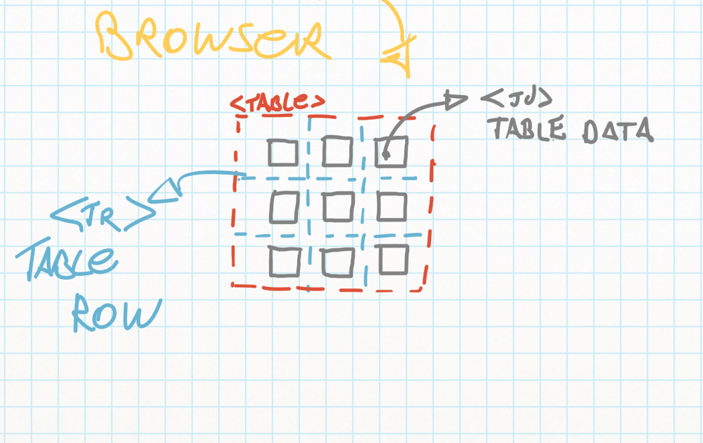
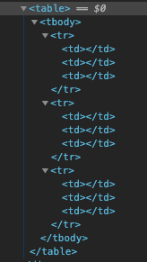
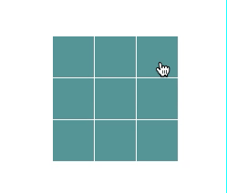
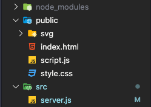

# Hash Game
 
## Como rodar em sua máquina:
 
- Faça um clone deste repositório para sua máquina;
- Execute os comandos abaixo.
 
```terminal
   % npm install
   % npm run start   
```
 
Após isso você poderá abrir em: http://localhost:3333
 
<p align="center">
   
</p>
 
### Quais tecnologias usei
Esse projeto foi feito com _HTML_, _CSS_, e _JavaScript_ no FrontEnd. No BackEnd utilizei _node.js_, _express_ e _socket.io_ para fazer a coneção com o BackEnd. O tutorial abaixo explica como fiz tudo passo a passo. __Boa leitura!__
 
---
 
## Como fazer:
 
Há algum tempo atrás eu havia feito um artigo sobre o [efeito gavetas](https://github.com/andre2l2/colors), e desta vez, resolvi criar mais um artigo. E irei explicar como fiz um jogo de cerquilha, ou jogo da velha para os mais íntimos. Onde você poderá conectar dois jogadores e disputar uma partida do jogo da velha. Só para deixar claro, eu sou o __mestre__ desse jogo!
 
Neste projeto eu utilizei _express_ e _socket.io_, para gerenciar o estado do jogo, para isso vamos começar a criar nosso FrontEnd, pois assim será mais intuitivo. Vamos codar!
 
Primeiro crie 3 arquivos, _index.html_, _script.js_ e _style.css_. Agora em nosso html iremos precisar apenas de uma div com o id hash. Pois dentro dela vamos injetar todo o html restante via javascript.
 
```html
   <body>
       <div id="hash"></div>
 
       <script src="./script.js"></script>
   </body>
```
 
Agora temos que centralizar essa div utilizando o nosso amado CSS <3.
 
```CSS
   * {
       /* Padronizar alguns comportamentos do navegador */
       margin: 0;
       padding: 0;
       box-sizing: border-box;
   }
 
   body {
       /* Define uma altura e largura em relação a tela do usuário */
       height: 100vh;
       width: 100vw;
 
       /* Centraliza os filhos do html ao centro */
       display: flex;
       flex-direction: column;
       justify-content: center;
       align-items: center;
   }
```
 
Com todo esse CSS pronto, vem a parte mais interessante em minha opinião, a logica do jogo. Vamos lá!
 
<p align="center">
   
</p>
 
Temos que começar injetando todo _html_ dentro da _div#hash_. Mas não podemos injetar diretamente, precisamos fazer um _for_, onde teremos um (3x3) três linhas por três colunas. Talvez seja um pouco abstrato pensar nisso, mas olhe para esse esboço:
 
<p align="center">
   
</p>
 
Perceba que as linhas são as _tr_ (table row) e cada uma das celuas são o _td_ (table data).
 
Agora precisamos criar uma variável chamada table, que receberá tudo o html. E a cada loop injetamos dentro da variável uma _tr_ e tres _td_.
 
```javascript
// Renderiza dentro da <div #hash />
function renderHashGame() {
   let table = `<table>`;
 
   for (let r = 0; r < 3; r++) {
       table += `<tr>`;
 
       for (let d = 0; d < 3; d++) {
           table += `<td>`;
 
           table += `</td>`;
       }
 
       table += `</tr>`;
   }
   table += `</table>`;
   document.querySelector('#hash').innerHTML = table;
}
```
 
Se você tentar executá-lo no navegador, não verá nada. Mas muita calma! Só porque não está aparecendo não quer dizer que não esteja funcionando.
Dê uma olhada no seu dev tools e verá que apareceu uma tabela com varias _tr_ e _td_, como mostrado abaixo.
 
<p align="center">
   
</p>
 
Legal né? Agora vamos estilizar cada umas dessas td, fazendo um quadrado de _50px_ por _50px_, com a cor que preferir, eu irei fazer com um tipo de "verde".
 
```css
#hash td {
   width: 50px;
   height: 50px;
   padding: 1px;
 
   background-color: cadetblue;
   cursor: pointer; /* Muda o cursor para um pontiro */
}
```
 
Agora se salva-lo e recarregar a página verá algo parecido com a imagem abaixo. Mas ainda temos que criar a mecânica do jogo como a vez de cada jogador e os clicks.
 
<p align="center">
   
</p>
 
Vamos implementar agora a função de click a todos os nove _td_, usando o _querySelectorAll_ ele nos retorna um array com todas as _td_. Mas se clicar neles não ira acontecer nada, pois não programamos uma ação ainda, vamos apenas colocar um _console.log_ para vermos que deu certo.
 
```javascript
// adiciona o evento de click a todos os <td>
function addEvents() {
   // Retorna um array com 9 itens contendo as td
   const allTableData = document.querySelectorAll('#hash td');
 
   // Faz um loop dentro do nosso array, pegando cada
   // um dos valores(value) e adiciona um click.
   allTableData.forEach((value, index) => {
       value.addEventListener('click', () => {
           console.log(index);
       })
   })
}
```
 
Agora se abrir o console do dev tools, irá ver que, ao clicar em um dos itens aparecerá o número que ele representa. E é isto que queremos para colocar o X e o círculo em seu respectivo lugar.
 
Então vem a parte mais legal, que será onde vamos criar a função responsável pela parte de interagir com o jogo. Temos que criar duas variáveis onde guardaremos o estado de cada item, e uma flag _(bandeira)_, que será usada para saber a vez do jogador.
 
```javascript
// Array de propriedades os valores podem ser 0, 1 e 2.
const items = [
   0, 0, 0,
   0, 0, 0,
   0, 0, 0
]
// Variavel responsavel pela vez de cada jogador
let flag = true;
```
 
A função abaixo é responsável por adicionar uma classe a cada uma das td.
 
```javascript
function toChangeArray(valIndex) {
   const allTableData = document.querySelectorAll('#hash td');
 
   // Verifica a flag se for true
   if (flag && items[valIndex] === 0) {
       items[valIndex] = 1;
 
       // adiciona uma classe x
       allTableData[valIndex].classList.add('x');
       flag = false;
 
   } else if (!flag && items[valIndex] === 0) {
       items[valIndex] = 2;
 
       // adiciona uma classe circule
       allTableData[valIndex].classList.add('circule');
       flag = true;
   }
}
```
 
Mas para que essas classes funcione teremos que adicionar um pouco mais de css no nosso arquivo de estilo.
 
```css
.circule {
   /* Adicionar um circulo no jogo */
   background-repeat: no-repeat;
   background-image: url(./svg/circule.svg);
}
 
/* Adicionar um x no jogo */
.x {
   /* Impede que o background se repita */
   background-repeat: no-repeat;
   background-image: url(./svg/x.svg);
}
```
 
Perceba que usamos um _background-image_ que está disponível dentro da pasta svg que você também poderá usar.
Pronto! Agora se salvar e testar no seu navegador já está funcionando.
 
<p align="center">
   
</p>
 
Temos 60% do projeto pronto, agora iremos para o BackEnd em _node_. Vamos começar importando os módulos necessários. Lembre-se não esqueça de fazer o _npm init -y_ antes.
 
```zsh
% npm install express
% npm install socket.io
% npm install nodemon -D
```
 
Talvez o express você já o conheça, mas a sacada desse porjéto é o socket.io, ele é um _FrameWork_ focado para chat, mas funciona também em muitas outras coisas. Como trocar informações com o frontend e atualizar todos os navegadores conectados.
Basicamente, quando o backend percebe alguma alteração, ele emite as informações para o frontend, assim todos os navegadores conectados serão atualizados simultaneamente. Legal né? Então vamos lá!
 
Crie uma pasta para separar o BackEnd do FrontEnd com a seguinte arquitetura de pastas:
 
<p align="center">
   
</p>
 
Dentro do diretório _src_ coloquei um arquivo chamado _server.js_, mas existe muita gente que chama de _app.js_. Você pode chama-lo como quiser. Sim você pode chamar seu BackEnd de "_jose.js_" se quiser!
 
Agora dentro do seu arquivo "_jose.js_", no meu caso é o _server_, temos que importar o express e o socket.io.
 
```javascript
const express = require('express');
const server = express();
 
server.get('/', (req, res) => {
   return res.send('test');
})
 
server.listen(3333);
```
 
Se salvar e executar esse arquivo usando o _nodemon_ ou o próprio _node_, na url _http://localhost:3333_ verá um test, na tela do navegador. Mais agora precisamos configurar o _node_ para servir aquivos estáticos.
 
```javascript
const express = require('express');
const server = express();
 
// Configurações:
server.use(express.urlencoded({ extended: true }));
// Configura a pasta pública do projeto
server.use(express.static('./public'));
// Permite que o express use json
server.use(express.json());
 
// Requisições
server.get('/', (req, res) => {
   return res.render('../public/index');
})
 
// Porta
server.listen(3333);
```
 
Agora vem a parte mais legal, vamos usar o _socket.io_ com o FrontEnd. Vamos lá de novo!
 
```javascript
const express = require('express');
const server = express();
 
server.use(express.urlencoded({ extended: true }));
// Configura a pasta pública do projeto
server.use(express.static('./public'));
// Permite que o express use json
server.use(express.json());
 
// Requisições
server.get('/', (req, res) => {
   return res.render('../public/index');
})
 
// Porta
const port = server.listen(3333);
 
// Importa o socket.io
const io = require('socket.io')(port);
 
// Cria uma conexão que ficará ouvidno a porta 3333
io.on('connection', (socket) => {
   socket.on('test', (data) => {
       // Cria um emit para o frontend.
       io.sockets.emit('test', {
           position: data.position,
       });
   })
})
```
 
Perceba que no _emit_ eu o chamei de test, recomendo que mude para game, ou um nome mais apropriado. Eu irei deixar assim, pois usarei apenas para testes.
 
__Acabou!__ 

Mais o menos. Precisamos voltar lá no FrontEnd e fazer algumas alterações. Temos que importar a _CDN_ do _socket.io_ para que possamos usar algumas funções.
 
```html
<body>
  
   <div id="hash"></div>
 
   <script src="https://cdnjs.cloudflare.com/ajax/libs/socket.io/2.0.4/socket.io.js"></script>
   <script src="./script.js"></script>
</body>
```
 
Agora dentro do _script.js_ vamos criar uma função _emit_, bem parecido com a que fizemos no BackEnd, lembrado que ela deve ter o mesmo nome que colocamos. No meu caso foi _test_. 
 
```javascript
// Faz uma conexão com o socket.io no BackEnd
const socket = io.connect('http://localhost:3333/');
 
// Quando houver alteração no BackEnd
socket.on('test', (data) => {
   toChangeArray(data.position);
})
```

Agora coloque esses _scripts_ no topo de tudo, e caso tenha dúvidas você pode olhar o arquivo principal. Mas até aqui não tem muito segredo.
E por fim, dentro da função de click, iremos enviar o _index_ (posição) do array para o BackEnd, para que ele atualize todos os navegadores.
 
```javascript
function addEvents() {
   const allTableData = document.querySelectorAll('#hash td');
 
   allTableData.forEach((value, index) => {
       value.addEventListener('click', () => {
           // Emite a posição para o servidor
           socket.emit('test', { position: index });
       })
   })
}
```
 
__Agora realmente acabou!__

Basta salvar, e executar em dois navegadores diferentes, para ver o resultado.
 
<p align="center">
   
</p>
 
---
 
## Como ajudar?
 
- Erros gramaticais sempre acabam surgindo no README.md, e caso encontre algum pode mandar a correção por aqui mesmo. Ficarei muito feliz. Obrigado!
 
## Desafios:
- Fazer uma função que identifique quando um usuário ganhou.
- Fazer um contador que mostra quantas vezes o usuário já ganhou.
 
> Não esqueça de fazer um fork e me mandar seu pull request, fechado?
 

