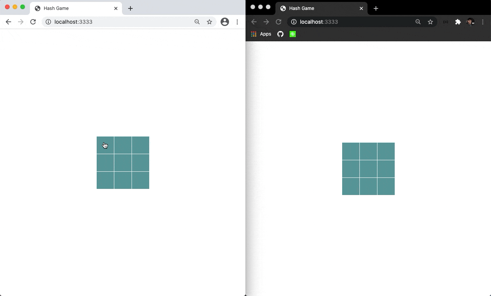

# Hash Game

## Como rodar em sua maquina:

* Faça um clone deste repositorio para sua maquina;
* Execute os comndos abaixo;

```terminal
    % npm install 
    % npm run start    
```

Após isso você poderá abrir em: http://localhost:3333

<p align="center">
    
</p>

---

## Como fazer:

Há algum tempo atraz eu havia feito um artigo sobre o [efeito gavetas](https://github.com/andre2l2/colors), e desta vez, resolvi criar mais um artigo. E irei explicar como fiz um jogo de cerquilha, ou jogo da velha para os mais intimos. Onde você poderá conectar dois jogadores e disputar uma partida do jogo da velha. Só para deixar claro, eu sou o __mestre__ desse jogo!

[working in progress]...